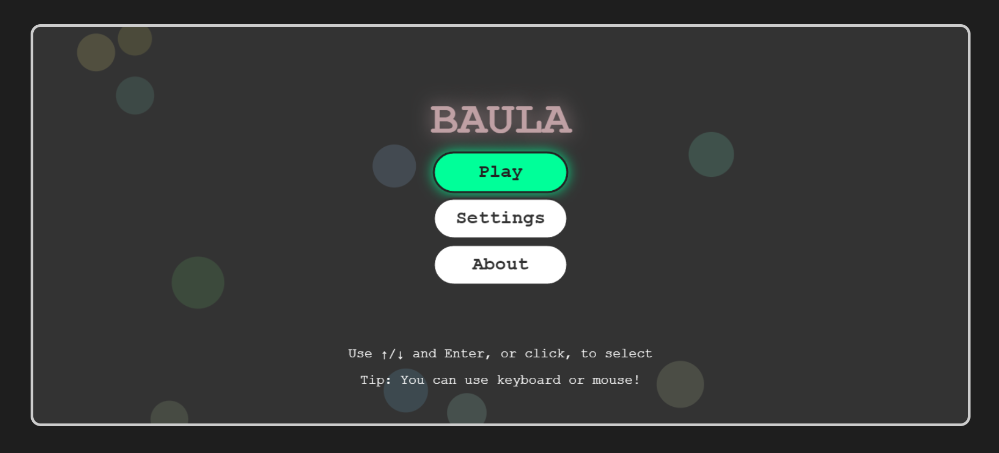
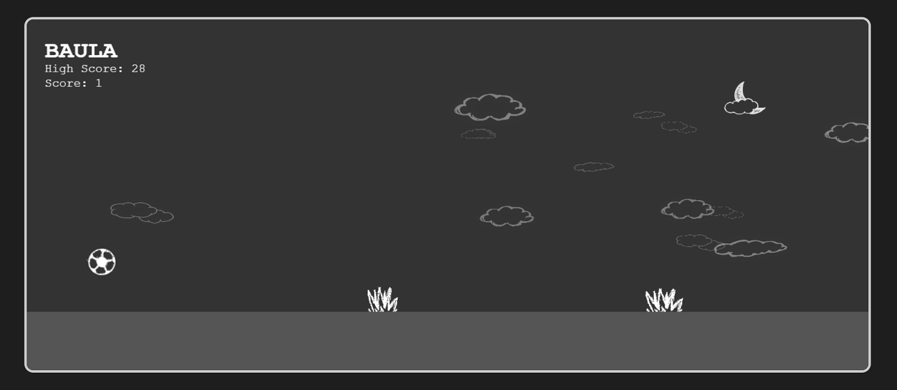
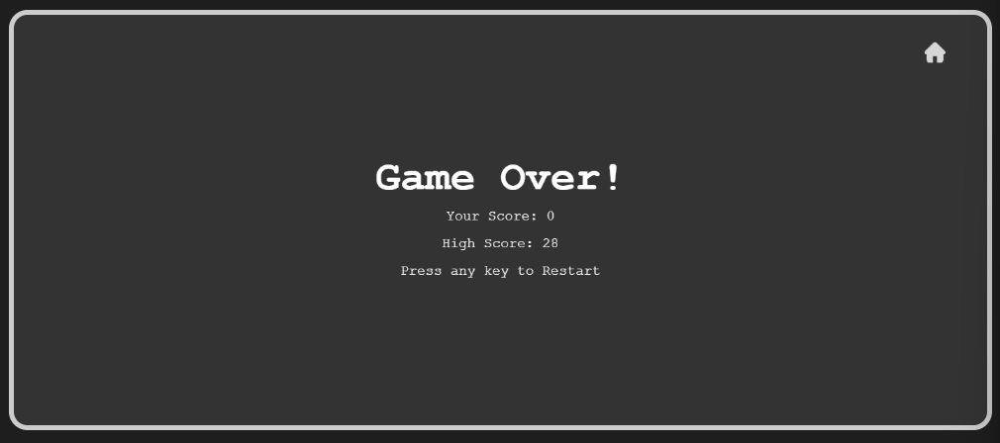

# BAULA

A fast, minimalist arcade runner built with HTML5 Canvas. Dodge obstacles, snag power-ups, and chase a new high score—all in the browser.

## Demo
- Live: Add your GitHub Pages link here after deploying (for example: `https://baula.netlify.app/`).
- Local: Open `index.html` in your browser, or run a tiny static server (optional).

## Features
- Slick, responsive gameplay with polished ball physics and bounce
- One extra mid-air jump for clutch saves
- Dynamic obstacle speed scaling for a smooth difficulty ramp
- Dual power-up system:
  - **Gold star**: Temporarily boost jump power (10 seconds)
  - **Blue star2**: 10x speed boost + grass immunity (10 seconds) - rare, unlocks at score 20+
- Parallax cloud layers and a drifting moon for atmospheric depth
- Score counter with persistent High Score (saved in your browser)
- Background music that plays during gameplay (loops automatically)
- Mobile-friendly: tap to jump; sliders and menus are touch-aware
- Keyboard and mouse support across menus/gameplay

## Controls
Desktop
- Space or Up Arrow: Jump (one extra jump while airborne)
- Down Arrow: Fast drop (from ground)
- Left/Right Arrows: Move horizontally
- Enter or Click: Select menu items / interact
- Esc/Back: Return from About/Commands/Settings to main menu

Mobile/Touch
- Tap: Jump (supports one extra jump)
- Touch & drag: Adjust sliders in Settings

Pro tip
- On Game Over, press any key to restart or click the home icon (top-right) to go back to the main menu.

## Run locally
You can simply open `index.html` in a modern browser. If you prefer a local server (recommended for consistent asset loading), you can use any static file server.

Examples (optional):
- Python 3: `python -m http.server 8000`
- Node (serve): `npx serve .`

Then visit `http://localhost:8000`.

## Deploy (GitHub Pages)
1. Commit your changes to the `main` branch.
2. In your GitHub repository, go to Settings → Pages.
3. Under “Build and deployment”, set Source to “Deploy from a branch”.
4. Select the `main` branch and `/ (root)` folder, then Save.
5. After a minute, your site will be live at `https://<your-username>.github.io/<repo-name>/`.
6. Update the Demo link in this README.

## Project structure
```
.
├─ index.html         # Game (HTML + JS in one file)
└─ assets/            # Images (ball, grass, cloud variants, moon, star, star2, home) + BG.wav audio
```

## Tech stack
- HTML5 Canvas + Vanilla JavaScript
- No external frameworks required

## Roadmap ideas
- Sound effects and background music (with mute toggle)
- Difficulty presets and accessibility options
- Additional power-up types (shield, slow-mo, score multipliers)
- Custom themes and color schemes

## Credits
- Game design and code: Bipin Yadav
- All images live in `assets/`

## License
No license specified yet. If you plan to open-source, consider adding a `LICENSE` file (e.g., MIT) so others know how they can use/contribute.
